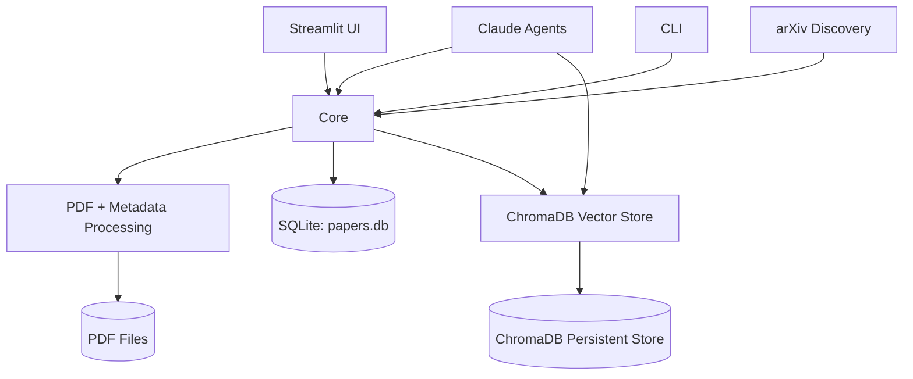

# Project Overview
MyPaperAgent is an agentic Python app for managing academic papers with local RAG, AI summaries,
notes, quizzes, and discovery workflows, exposing both a Streamlit UI and a CLI backed by
SQLite + ChromaDB storage.

## Repository Structure
- `data/` Local runtime storage (SQLite DB, vector DB, PDFs).
- `logs/` Application log output directory.
- `src/` Application source code (agents, core, RAG, UI, CLI).
- `tests/` Pytest test suite.
- `.env` Local environment configuration (contains secrets).
- `.env.example` Example environment variables and defaults.
- `.gitignore` Git ignore rules.
- `LICENSE` GPL-3.0 license text.
- `README.md` Project overview and usage.
- `pyproject.toml` Project metadata and tool configuration.
- `run_ui.py` UI launch script.

## Build & Development Commands
1. Install dependencies (creates venv automatically):
   ```bash
   uv sync --all-extras
   ```
2. Initialize the database:
   ```bash
   uv run python -m src.utils.database init
   ```
3. Run the Streamlit UI:
   ```bash
   python run_ui.py
   ```
4. Run the UI directly with uv:
   ```bash
   uv run streamlit run src/ui/app.py
   ```
5. Run the CLI (example):
   ```bash
   uv run python -m src.cli list
   ```
6. Run tests:
   ```bash
   uv run pytest
   ```
7. Run tests with coverage:
   ```bash
   uv run pytest --cov=src --cov-report=term-missing --cov-report=html tests/
   ```
8. Run fast tests only:
   ```bash
   uv run pytest -m "not slow"
   ```
9. Format code:
   ```bash
   uv run black src/ tests/
   ```
10. Check formatting:
    ```bash
    uv run black --check src/ tests/
    ```
11. Lint:
    ```bash
    uv run ruff check src/ tests/
    ```
12. Type-check:
    ```bash
    uv run mypy src/
    ```
13. Debug:
    > TODO: Document debug commands or configurations.
14. Deploy:
    > TODO: Document deployment targets and commands.

## Code Style & Conventions
- Formatting: Black with line length 100 (see `pyproject.toml`).
- Linting: Ruff with pycodestyle/pyflakes/isort/bugbear/pyupgrade enabled.
- Typing: Mypy in strict mode with selective ignore-missing-imports for dependencies.
- Naming patterns: > TODO: Document naming conventions if they differ from standard Python.
- Commit message template: > TODO: Define a commit message template.

## Architecture Notes

Major flows: the UI/CLI trigger core managers which persist metadata to SQLite, store PDFs on disk,
and index text chunks into ChromaDB for semantic search. Agents use the core layer and RAG
retriever to generate summaries, Q&A, and quizzes. Discovery pulls papers from external sources
and feeds them into the same ingest path.

## Testing Strategy
- Unit tests: `pytest` under `tests/` with markers for `unit`, `integration`, and `slow`.
- Integration tests: Marked with `@pytest.mark.integration` (run with `pytest -m integration`).
- Coverage: Enabled by default via pytest addopts in `pyproject.toml`.
- CI: > TODO: Document CI test commands and environments if configured.

## Security & Compliance
- Secrets: API keys are loaded from `.env`; never commit real keys.
- Dependency scanning: > TODO: Document any dependency or vulnerability scanning.
- Data handling: PDFs and embeddings are stored locally under `data/`.
- License: GPL-3.0 in `LICENSE`.

## Agent Guardrails
- Do not edit `.env` or commit secrets unless explicitly requested.
- Avoid modifying `data/` and `logs/` contents unless the task requires it.
- Prefer changes under `src/` and `tests/` and keep edits minimal.
- Required reviews: > TODO: Define any files that require human review before merge.
- Rate limits / API usage: > TODO: Document quotas or limits for external APIs.

## Extensibility Hooks
- Environment configuration: see `.env.example` for all supported variables.
- Feature flags: > TODO: Document any feature-flag system if added.
- Plugin points: > TODO: Document extension points (new agents, discovery sources, UI pages).

## Further Reading
- `README.md`
- `src/ui/README.md`
